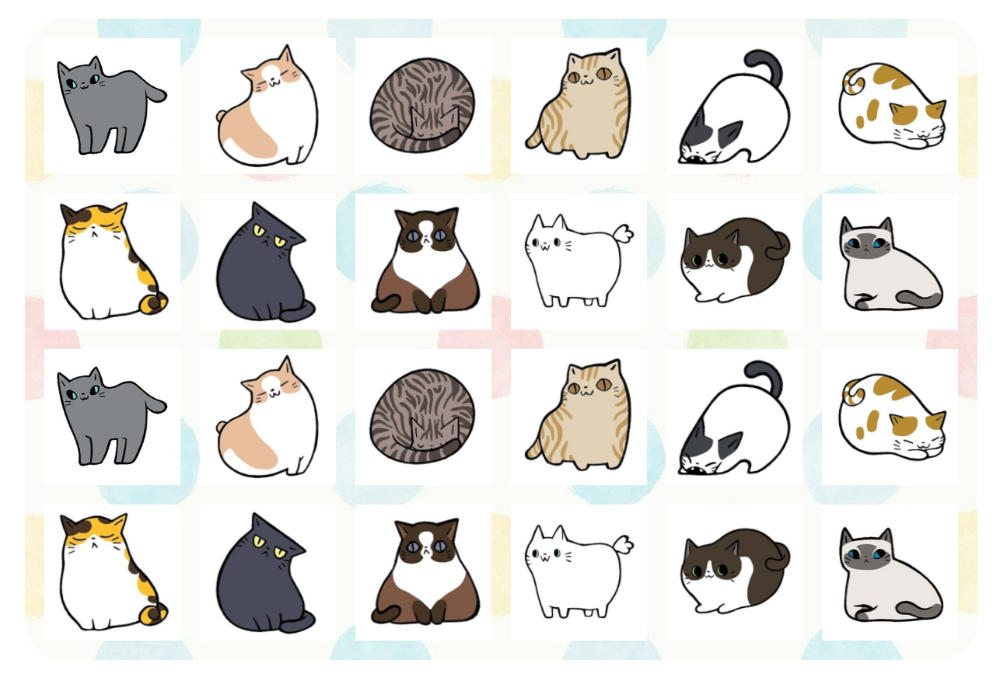
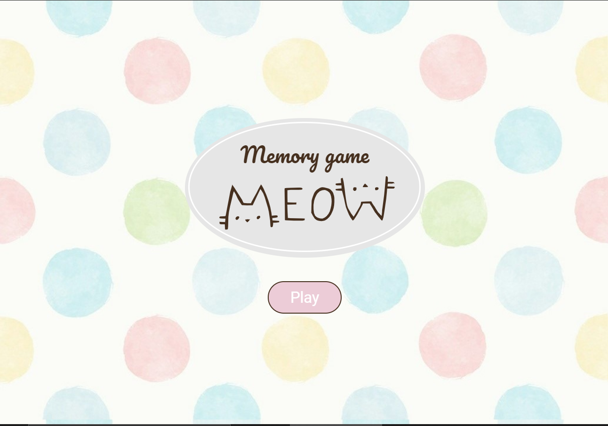
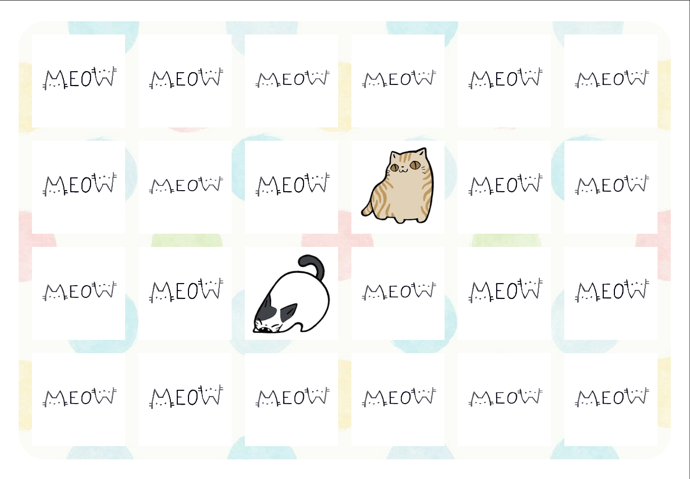

# Game Memory with cats on React 😺

### Technologies that were used in the project:
* React (React-create-app setup)

### How to prepare, build and run the project📚:
* Clone this repository

* Run command `npm install` in the root directory to install necessary dependencies

### Run your local server 🚀
* Run the command `npm run start` in the root directory

* Go to http://localhost:3000/ to play the game

---
#### Rules

* Start the game by clicking a play button.
 
* Then try to find another card that has the same image as the first. 

* If you can't find a pair, the flipped cards will be flipped back with the face down. 
* Try to remember these images as it becomes easier to find pairs the longer you play. 
* When you find a pair they are removed from the board and when you find all the pairs in this memory, you have completed the game

